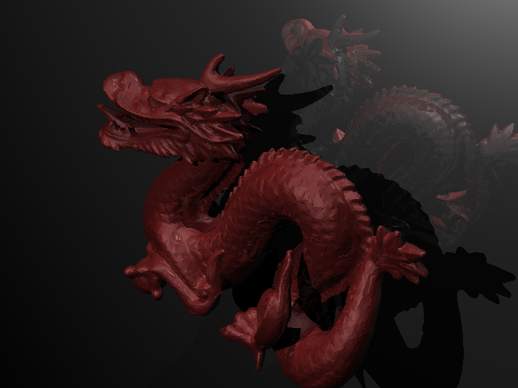
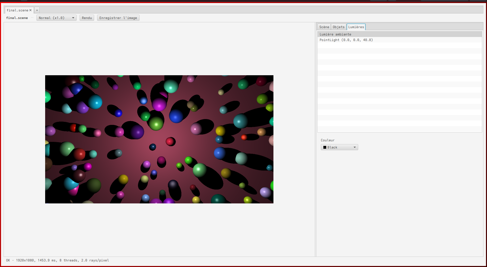
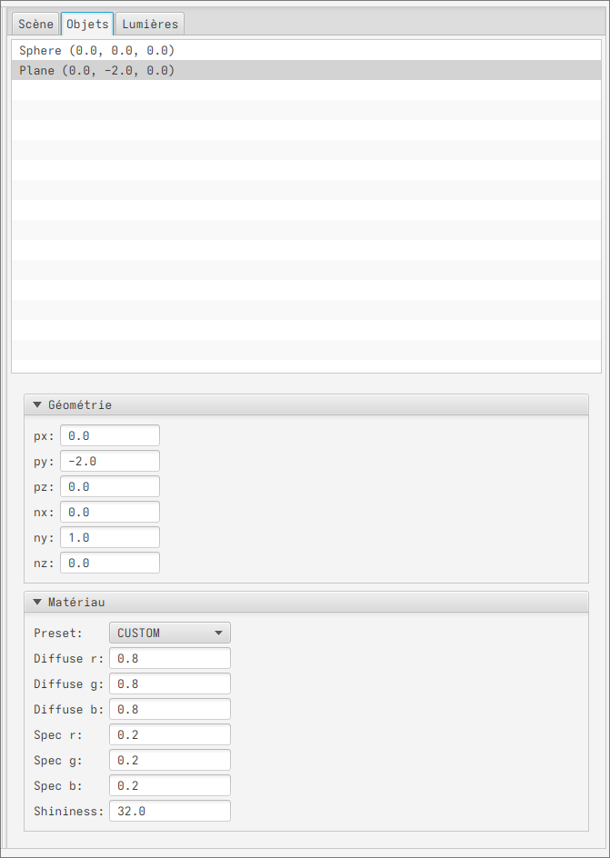

# TP3 - Raytracer


[](https://codecov.io/gh/Ninhache/Raytracer)

This project is a raytracer written in Java with two entry points:

- a CLI version (console only)
- a GUI version based on JavaFX

You can build and run both versions using Maven and a Makefile.

<p align="center">
  
  
</p>


## 1. Requirements

- Java 21 (JDK 21)
- Maven 3.x
- Make (for the Makefile commands, optional but recommended)

Check your tools:

```bash
java -version
mvn -v
make -v
````

---

## 2. Project structure

Main elements of the project:

* `src/main/java/fr/ninhache/RaytracerCli.java`
  CLI entry point (no JavaFX), used by the `tp3-1.0-SNAPSHOT-cli.jar`

* `src/main/java/fr/ninhache/RaytracerApp.java`
  JavaFX entry point (extends `javafx.application.Application`), used for the GUI

* `pom.xml`
  Maven configuration (dependencies, plugins, build, JavaFX and Reflections handling)

* `Makefile`
  Helper commands to build and run the project (CLI and GUI)


For more detailed explanation, follow [this link](resources/additional_explanations.md)
> Mainly cover how the handlers are handled.. and why reflection has been used

---

## 3. Build

You can build the project either with Maven directly or via the Makefile.

### 3.1 Build with Maven only

From the project root:

```bash
mvn clean package
```

This will:

* compile the sources
* run the tests
* generate JaCoCo coverage
* build the JARs
* copy runtime dependencies into `target/libs` (used for the GUI)

Resulting artifacts in `target/`:

* `tp3-1.0-SNAPSHOT-cli.jar`
  Fat JAR for the CLI version, includes all required dependencies

* `tp3-1.0-SNAPSHOT.jar`
  Standard JAR for the GUI version (JavaFX), main class `fr.ninhache.RaytracerApp`

* `libs/`
  Directory containing all runtime dependencies (JavaFX, Reflections, etc.) used on the module-path for the GUI

### 3.2 Build with Make

From the project root:

```bash
make build
```

This is equivalent to:

```bash
mvn clean package
```

You can also clean the project:

```bash
make clean
# or
mvn clean
```

---

## 4. CLI usage

The CLI version is packaged as a fat JAR and does not require any external classpath or module-path setup.

The expected usage of the CLI is:

```text
Usage: java -jar raytracer.jar <scene_file>
```

With the Makefile, you can run it directly.

First, build the project:

```bash
make build
```

Then run the CLI with a scene file:

```bash
make run-cli src/main/resources/scenes/jalon5/tp54.test
# All scenes are in `src/main/resources/scenes`
```

This is equivalent to:

```bash
java -jar target/tp3-1.0-SNAPSHOT-cli.jar src/main/resources/scenes/jalon5/tp54.test
```

As a result we get something as :
```
[...]
Format détecté : LineBasedFormatParser
Résumé temporaire
Dimensions: 640x480
Sortie: tp54.png
Objets: 2
Lumières: 1
BVH: activé
Image écrite : tp54.png
Statistiques approximatives : RenderStats[640x480, multi, threads=8, time=185.04 ms, rays=614400 (P=307200, S=307200, R=0), rays/pixel=2.0, rays/s=3.3 M]
```

The line `Image écrite` give the output that got written to our system
```
firefox tp54.png
# Firefox has been used as an example
```

Would open tp54 :


---

## 5. GUI (JavaFX) usage

The GUI version uses JavaFX and Reflections.
Because JavaFX is provided as modules and some dependencies (like Reflections) are automatic modules, the GUI needs:

* `target/libs` on the module-path
* JavaFX and Reflections explicitly added as root modules
* the application JAR on the classpath

Everything is already wired through the Makefile.

### 5.1 Run GUI via Makefile (recommended)

Build the project:

```bash
make build
```

Then run the GUI:

```bash
make run-gui
```

Internally, this executes something equivalent to:

```bash
java \
  --enable-native-access=javafx.graphics \
  --module-path target/libs \
  --add-modules javafx.controls,javafx.swing,org.reflections \
  -cp target/tp3-1.0-SNAPSHOT.jar \
  fr.ninhache.RaytracerApp
```

Explanation:

* `target/tp3-1.0-SNAPSHOT.jar` is the GUI JAR containing the application code
* `target/libs` contains all runtime dependencies from Maven (JavaFX, Reflections, etc.)
* `--add-modules javafx.controls,javafx.swing,org.reflections` ensures JavaFX and Reflections modules are available at runtime

You can also pass arguments to the GUI (if the application uses them):

```bash
make run-gui some_argument
```

Here's the gui


Thanks to the right menu you can edit some parts of the scenes like the objects



### 5.2 Run GUI via Maven JavaFX plugin

Alternatively, you can use the JavaFX Maven plugin:

```bash
make run-gui-mvn
# or directly:
mvn javafx:run
```

The plugin configures the module-path and modules automatically based on the Maven dependencies.

---

## 6. Tests and code coverage

Tests use JUnit 5 and coverage is measured with JaCoCo.

To run tests and generate the coverage report:

```bash
mvn test
```

or simply:

```bash
mvn clean package
```

The JaCoCo report is generated under:

```text
target/site/jacoco/index.html
```

Open this file in a browser to inspect coverage.

---

## 7. Makefile commands summary

From the project root:

Build:

```bash
make build
# or
mvn clean package
```

Run CLI (with scene file):

```bash
make run-cli path/to/scene.file
# internally:
# java -jar target/tp3-1.0-SNAPSHOT-cli.jar path/to/scene.file
```

Run GUI (JavaFX, direct Java command):

```bash
make run-gui
# internally:
# java --enable-native-access=javafx.graphics \
#      --module-path target/libs \
#      --add-modules javafx.controls,javafx.swing,org.reflections \
#      -cp target/tp3-1.0-SNAPSHOT.jar \
#      fr.ninhache.RaytracerApp
```

Run GUI via Maven JavaFX plugin:

```bash
make run-gui-mvn
# internally:
# mvn javafx:run
```

Clean build outputs:

```bash
make clean
# or
mvn clean
```

---

## 8. Known warnings and limitations

You may see warnings like:

```text
WARNING: A terminally deprecated method in sun.misc.Unsafe has been called
WARNING: sun.misc.Unsafe::allocateMemory has been called by com.sun.marlin.OffHeapArray ...
```

These come from JavaFX internals on JDK 21 and do not prevent the application from running.
They may be removed in future JavaFX or JDK releases.